# GTACD — Pipeline CI/CD sécurisé avec GitHub Actions et Ansible

Runtrack — La Plateforme — Administrateur d'Infrastructures Sécurisées

Mise en place d'une chaîne d'intégration et de déploiement continus intégrant
des contrôles de sécurité à chaque étape : vérification automatisée du code,
gestion des secrets, durcissement des accès SSH et déploiement automatisé par
Ansible.

**Statut du projet** — CI opérationnelle sur GitHub Actions. Playbook Ansible
validé en exécution réelle sur la VM cible (Nginx installé, application servie,
idempotence vérifiée). Seule la liaison runner GitHub → VM est empêchée par
l'architecture réseau de l'établissement ; le job de déploiement correspondant
est conservé et conditionné. Voir [Contrainte réseau](#contrainte-réseau-et-limites-de-lenvironnement).

---

## Sommaire

- [Architecture du projet](#architecture-du-projet)
- [Concepts fondamentaux](#concepts-fondamentaux)
- [Job 1 — Application et script de vérification](#job-1--application-et-script-de-vérification)
- [Job 2 — Premier workflow CI](#job-2--premier-workflow-ci)
- [Job 3 — Secrets et variables d'environnement](#job-3--secrets-et-variables-denvironnement)
- [Job 4 — Serveur de déploiement sécurisé](#job-4--serveur-de-déploiement-sécurisé)
- [Job 5 — Playbook Ansible](#job-5--playbook-ansible)
- [Job 6 — Intégration Ansible dans le workflow CD](#job-6--intégration-ansible-dans-le-workflow-cd)
- [Job 7 — Test du cycle complet](#job-7--test-du-cycle-complet)
- [Job 8 — Bilan et perspectives en cyberdéfense](#job-8--bilan-et-perspectives-en-cyberdéfense)
- [Contrainte réseau et limites de l'environnement](#contrainte-réseau-et-limites-de-lenvironnement)

---

## Architecture du projet

```
gtacd/
├── .github/
│   └── workflows/
│       ├── ci_cd_full.yml                   # Pipeline complet : CI + CD
│       └── secure-deployment-simulation.yml # Validation de la config sécurité
├── ansible/
│   ├── deploy.yml            # Playbook de déploiement Nginx
│   └── nginx_vhost.conf.j2   # Template Jinja2 du vhost
├── app/
│   ├── check_app.sh          # Script de vérification (test simulé)
│   └── index.html            # Application web minimale
├── docs/                     # Captures d'écran de la documentation
├── .gitignore
└── README.md
```

**Environnement**

| Élément | Valeur |
|---|---|
| Poste de travail | Windows — PowerShell, Git Bash, VS Code |
| Serveur cible | VM Debian 13 (Trixie), réseau local |
| Runner CI | `ubuntu-latest` (GitHub-hosted) |
| Ansible | core 2.19.4, Python 3.13, Jinja 3.1.6 |
| Utilisateur de déploiement | `deployuser` (non-root, sudo NOPASSWD) |
| Clé SSH | RSA 2048 bits, dédiée au projet, sans passphrase |

Le fichier `.gitignore` exclut du versionnement l'inventaire Ansible (qui
contient l'adresse du serveur cible) ainsi que tout fichier de clé.

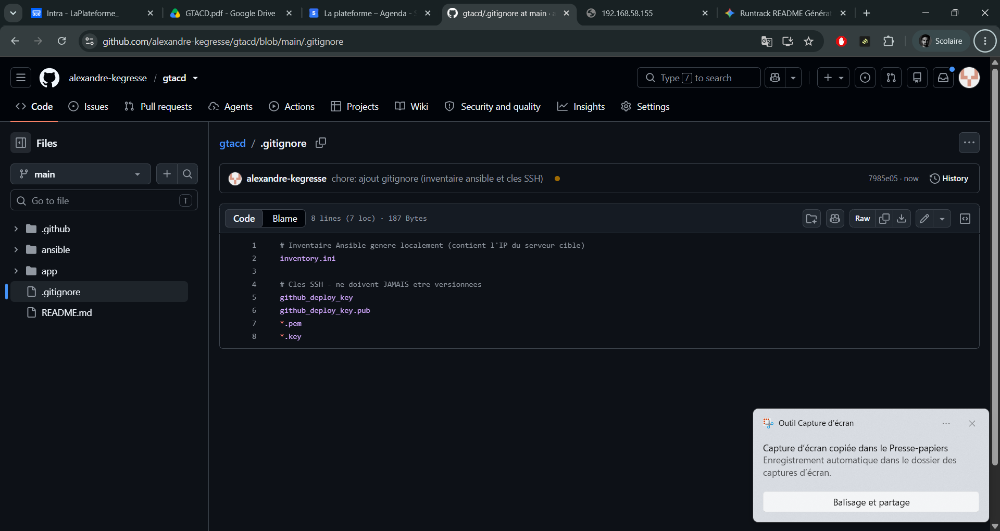

---

## Concepts fondamentaux

### Intégration Continue, Livraison Continue, Déploiement Continu

**L'Intégration Continue (CI)** consiste à fusionner fréquemment le travail des
développeurs dans une branche commune, chaque fusion déclenchant une
construction et une batterie de tests automatisés. L'objectif est de détecter
les régressions en quelques minutes plutôt qu'en fin de cycle.

**La Livraison Continue (CD — Continuous Delivery)** prolonge la CI : à l'issue
des tests, un artefact déployable est produit et validé automatiquement. La
mise en production reste déclenchée manuellement.

**Le Déploiement Continu (CD — Continuous Deployment)** supprime cette
validation manuelle : tout commit qui passe l'ensemble des contrôles part
automatiquement en production.

La distinction est structurante en sécurité : le Déploiement Continu exige un
niveau de confiance dans les contrôles automatisés bien supérieur, puisque
plus aucun humain ne relit avant la production.

### Pourquoi le CI/CD est devenu indispensable

- **Réduction du délai de correction** — une vulnérabilité identifiée est
  corrigée et déployée en minutes au lieu de semaines.
- **Reproductibilité** — le déploiement est décrit sous forme de code, donc
  identique à chaque exécution. Fin de la dérive de configuration entre
  environnements.
- **Traçabilité** — chaque mise en production est rattachée à un commit, un
  auteur, un horodatage et des logs d'exécution. C'est la base de tout audit
  et de toute réponse à incident.
- **Élimination des erreurs manuelles** — la majorité des incidents de
  production proviennent d'opérations manuelles non reproductibles.

### Risques de sécurité propres à l'automatisation des pipelines

| Risque | Description | Contre-mesure appliquée ici |
|---|---|---|
| Fuite de secrets | Clé ou token affiché dans les logs, ou commité en clair | GitHub Secrets + masquage automatique + `.gitignore` |
| Compromission de la chaîne d'approvisionnement | Une action tierce malveillante ou compromise s'exécute avec les droits du pipeline | Actions officielles, versions épinglées (`@v4`, `@v0.9.0`) |
| Privilèges excessifs | Le pipeline dispose de droits root sur la cible | Utilisateur `deployuser` dédié, sudo restreint |
| Injection de code | Une entrée non maîtrisée est interpolée dans un `run:` | Passage par variables d'environnement plutôt que par interpolation directe |
| Persistance sur le runner | Un secret reste sur le disque du runner | Runner éphémère, `chmod 600` sur les fichiers sensibles |

### Anatomie d'un workflow GitHub Actions

- **Workflow** — un fichier YAML dans `.github/workflows/`, décrivant un
  processus automatisé complet.
- **Event** — le déclencheur (`push`, `pull_request`, `schedule`,
  `workflow_dispatch`).
- **Job** — un ensemble d'étapes s'exécutant sur une même machine. Les jobs
  sont parallèles par défaut, sauf dépendance déclarée via `needs`.
- **Step** — une étape unitaire : soit une commande shell (`run`), soit une
  action réutilisable (`uses`).
- **Runner** — la machine d'exécution, hébergée par GitHub ou auto-hébergée.
- **Action** — un composant réutilisable et versionné.
- **Secret** — une valeur chiffrée au repos, injectée à l'exécution et masquée
  dans les logs.

---

## Job 1 — Application et script de vérification

Création d'une application web minimale dans `app/` et d'un script Bash de
vérification simulant une phase de test.

Le script `check_app.sh` contrôle la présence de `app/index.html` et renvoie
un code de sortie normalisé : `0` en succès, `1` en échec. Ce code de sortie
est le contrat qui permet à GitHub Actions de déterminer le résultat de
l'étape — toute valeur non nulle interrompt le job.

**Point d'attention Windows** — le bit d'exécution n'existe pas sur NTFS. Il
faut le déclarer explicitement dans l'index Git, sans quoi le runner Linux
retourne `Permission denied` :

```bash
git update-index --chmod=+x app/check_app.sh
```

---

## Job 2 — Premier workflow CI

Workflow déclenché sur chaque `push` vers `main`, avec un job unique
`build-and-test` exécuté sur `ubuntu-latest` :

1. `actions/checkout@v4` — clone le dépôt sur le runner
2. exécution de `./app/check_app.sh`
3. affichage du contenu de `app/index.html` dans les logs

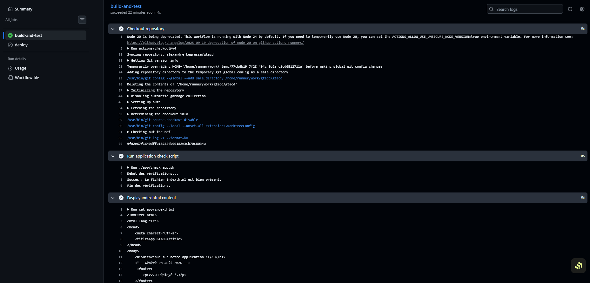

---

## Job 3 — Secrets et variables d'environnement

### Pourquoi les GitHub Secrets plutôt que des valeurs en clair

Un secret écrit en clair dans le dépôt est exposé à toute personne y ayant
accès en lecture — et sur un dépôt public, à la planète entière. Des robots
scannent GitHub en permanence à la recherche de clés d'API ; le délai moyen
entre la publication d'une clé AWS et sa première exploitation se compte en
minutes.

Le problème est aggravé par la nature de Git : **un secret commité reste dans
l'historique même après suppression**. Le retirer suppose une réécriture
complète de l'historique (`git filter-repo`), une invalidation de tous les
forks et clones existants, et surtout une rotation immédiate du secret — la
seule mesure réellement efficace.

Les GitHub Secrets répondent à ce problème :

- chiffrés au repos, jamais lisibles en clair depuis l'interface après saisie
- injectés uniquement à l'exécution, dans le processus qui en a besoin
- automatiquement masqués (`***`) dans les logs
- non transmis aux workflows déclenchés depuis un fork

### Risques majeurs en cas d'exposition

- **Mouvement latéral** — une clé SSH de déploiement donne accès au serveur,
  qui donne accès au reste du réseau interne.
- **Empoisonnement de la chaîne d'approvisionnement** — un attaquant disposant
  de la clé de déploiement pousse du code malveillant vers la production, qui
  atteint tous les utilisateurs finaux.
- **Persistance discrète** — l'attaquant conserve un accès légitime en
  apparence, difficile à distinguer de l'activité normale du pipeline.
- **Coût de remédiation** — rotation de tous les secrets, audit complet de
  l'historique, et selon les données concernées, notification RGPD sous 72h.

### Configuration réalisée

Secrets créés dans `Settings → Secrets and variables → Actions` :

| Secret | Usage |
|---|---|
| `FAKE_API_TOKEN` | Démonstration du masquage automatique |
| `ENV_TYPE` | Valeur `DEV` |
| `SSH_PRIVATE_KEY` | Clé privée de déploiement |
| `SERVER_IP` | Adresse de la VM cible |
| `SERVER_USER` | Utilisateur de déploiement |

Une étape du workflow affiche un secret, une variable personnalisée et une
variable prédéfinie (`RUNNER_OS`) pour observer le comportement du masquage.

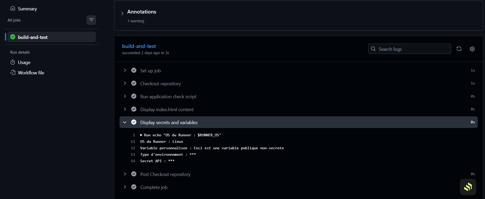

**Limite importante à connaître** — le masquage repose sur une correspondance
littérale de chaîne. Il est contournable : un secret encodé en base64,
inversé, ou affiché caractère par caractère apparaît en clair. Le masquage est
un filet de sécurité, pas un contrôle. La règle reste de ne jamais afficher un
secret volontairement.

### Simulation d'un échec contrôlé

Modification de `check_app.sh` pour renvoyer `exit 1`, push, observation de
l'échec, analyse des logs, puis retour à `exit 0`.

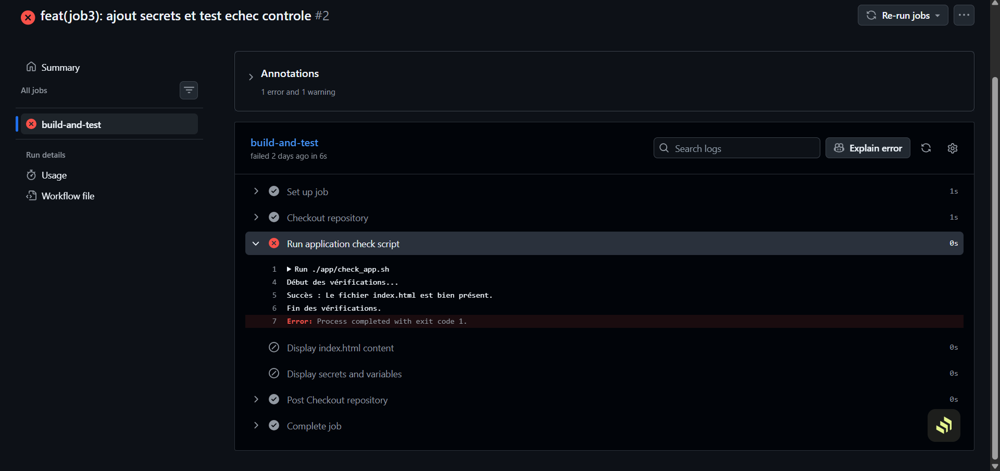

Cette manipulation reproduit la démarche d'analyse post-incident : localiser
l'étape en échec, remonter au code de sortie, corréler avec le commit
responsable via l'horodatage et le SHA.

On observe aussi un comportement important : les étapes suivantes passent en
`skipped`. Un job GitHub Actions s'interrompt au premier échec, ce qui évite
qu'un déploiement s'exécute après un test raté.

---

## Job 4 — Serveur de déploiement sécurisé

### Utilisateur dédié et moindre privilège

Un utilisateur `deployuser` non-root a été créé sur la VM, exclusivement
destiné aux opérations de déploiement automatisées.

**Pourquoi ne pas utiliser root :**

- **Rayon d'explosion** — la clé de déploiement finit par circuler : elle est
  stockée chez GitHub, chargée sur des runners tiers, potentiellement lisible
  par plusieurs personnes. Si elle donne un accès root, sa compromission
  équivaut à la compromission totale du serveur.
- **Traçabilité** — les actions de `deployuser` sont distinguables dans les
  logs de celles des administrateurs humains. Avec root partagé, toute
  imputation devient impossible, ce qui ruine l'analyse forensique.
- **Confinement des erreurs** — un playbook mal écrit exécuté en root peut
  détruire le système ; le même playbook en utilisateur restreint échoue
  proprement.
- **Révocation** — désactiver un compte de service est immédiat et sans effet
  de bord, contrairement à une rotation de credentials root.

La restriction sudo gagnerait à être ciblée en production. Un `NOPASSWD: ALL`
revient à donner root avec une étape supplémentaire :

```
# /etc/sudoers.d/deployuser
deployuser ALL=(root) NOPASSWD: /usr/bin/systemctl restart nginx, /usr/bin/apt-get
```

### Clé SSH dédiée

Génération d'une paire RSA 2048 bits sans passphrase, nommée
`github_deploy_key`, distincte de toute clé personnelle.

```bash
ssh-keygen -t rsa -b 2048 -f ~/.ssh/github_deploy_key -N ""
```

**Pourquoi ne jamais réutiliser ses clés personnelles :**

- Une clé personnelle ouvre généralement l'accès à de nombreux systèmes ; sa
  compromission via un pipeline propage l'incident bien au-delà du projet.
- L'absence de passphrase, requise pour l'automatisation, est acceptable pour
  une clé à usage unique et périmètre restreint — inacceptable pour une clé
  personnelle.
- Une clé personnelle identifie une personne. L'utiliser dans un automate rend
  les logs mensongers : les actions du pipeline apparaissent comme celles de
  l'individu.

**Avantages d'une clé par projet ou environnement :**

- Révocation chirurgicale — retirer une ligne de `authorized_keys` neutralise
  un seul périmètre.
- Rotation indépendante, sans coordination globale.
- Cloisonnement des environnements : la clé de préproduction n'ouvre pas la
  production.
- Attribution nette dans les logs : chaque empreinte de clé correspond à un
  usage identifié.

Permissions à respecter côté serveur, sans quoi le démon SSH refuse la clé :

```bash
chmod 700 ~/.ssh
chmod 600 ~/.ssh/authorized_keys
```

Test de connexion validé : authentification par clé sans mot de passe, et
exécution sudo sans invite.

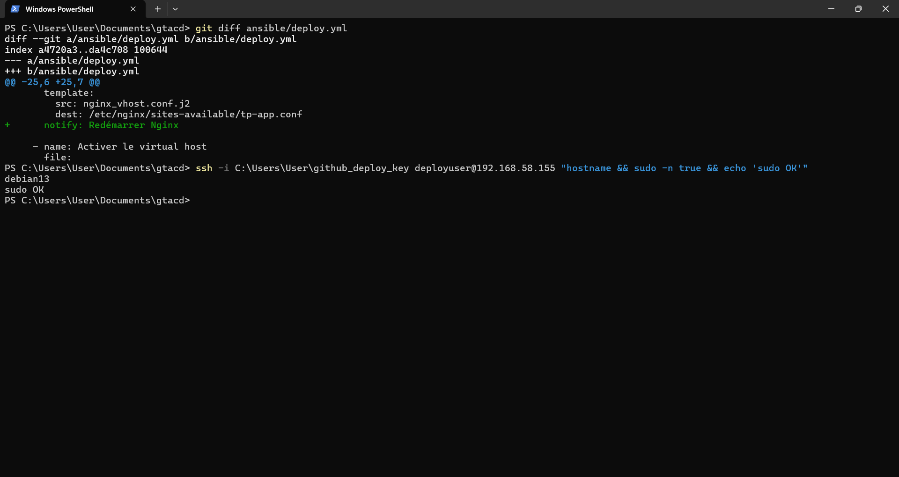

### Workflow de validation de configuration

Le fichier `.github/workflows/secure-deployment-simulation.yml` valide la
configuration sans nécessiter d'accès réseau à la VM :

- présence et format de `SSH_PRIVATE_KEY` (en-tête PEM, taille de clé, absence
  de passphrase)
- présence de `SERVER_IP` et `SERVER_USER`
- affichage des commandes de déploiement qui seraient exécutées
- contrôles de bonnes pratiques

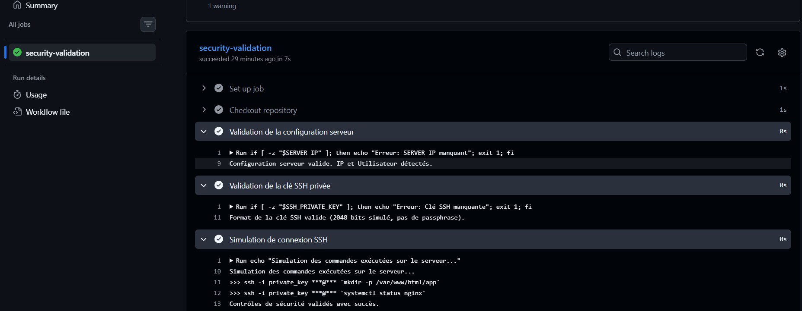

### Mesures supplémentaires en production réelle

- **OIDC plutôt que clés statiques** — GitHub Actions peut obtenir un jeton
  d'identité fédéré à durée de vie très courte, supprimant le besoin de
  stocker une clé longue durée.
- **Environnements protégés** — approbation manuelle obligatoire, restriction
  par branche, réviseurs désignés avant tout déploiement en production.
- **Runner auto-hébergé en zone de confiance** — évite d'exposer la
  production à des runners partagés.
- **Bastion / jump host** — le serveur applicatif n'est jamais joignable
  directement depuis Internet.
- **Épinglage des actions par SHA** plutôt que par tag, un tag pouvant être
  redéplacé vers un commit malveillant.
- **Restriction de `permissions:`** au strict nécessaire dans chaque workflow.
- **Rotation automatisée** des clés de déploiement et alerting sur toute
  authentification hors fenêtre de déploiement attendue.
- **Signature des commits** pour garantir l'origine du code déployé.

---

## Job 5 — Playbook Ansible

### Contenu du playbook

Le playbook `ansible/deploy.yml` automatise le déploiement :

1. installation de Nginx
2. création du répertoire de destination `/var/www/html/tp-app`
3. copie des fichiers depuis `app/`
4. génération de la configuration du vhost depuis le template Jinja2
5. activation du vhost par lien symbolique vers `sites-enabled/`
6. suppression du site par défaut pour éviter les conflits
7. redémarrage de Nginx via un **handler**

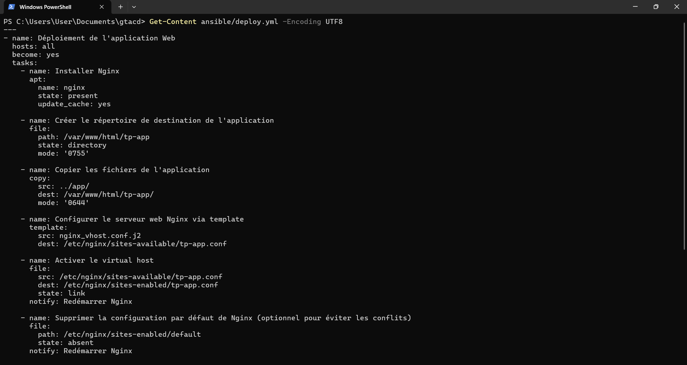

L'usage d'un handler plutôt que d'une tâche de redémarrage systématique est un
choix d'idempotence : le service n'est rechargé que si la configuration a
réellement changé. Ansible dédoublonne les handlers — même notifiés par
plusieurs tâches, ils ne s'exécutent qu'une fois en fin de play.

Le template `nginx_vhost.conf.j2` paramètre l'adresse du serveur par
`lookup('env', 'SERVER_IP')`. Ce lookup est évalué sur la machine qui *exécute*
Ansible, pas sur la cible : c'est ce qui permet au même template de
fonctionner en local et dans le workflow GitHub Actions, où la valeur provient
du secret.

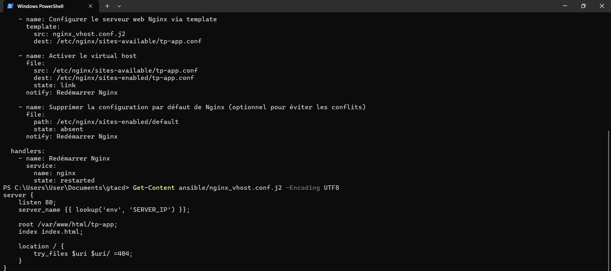

### Exécution réelle sur la VM

Le playbook a été exécuté depuis la VM Debian elle-même, en connexion locale.
Cette approche valide l'intégralité de la logique de déploiement (installation,
copie, templating, gestion de service) sans dépendre de la liaison réseau
entre le runner GitHub et la VM.

Transfert des sources et installation d'Ansible sur la cible :

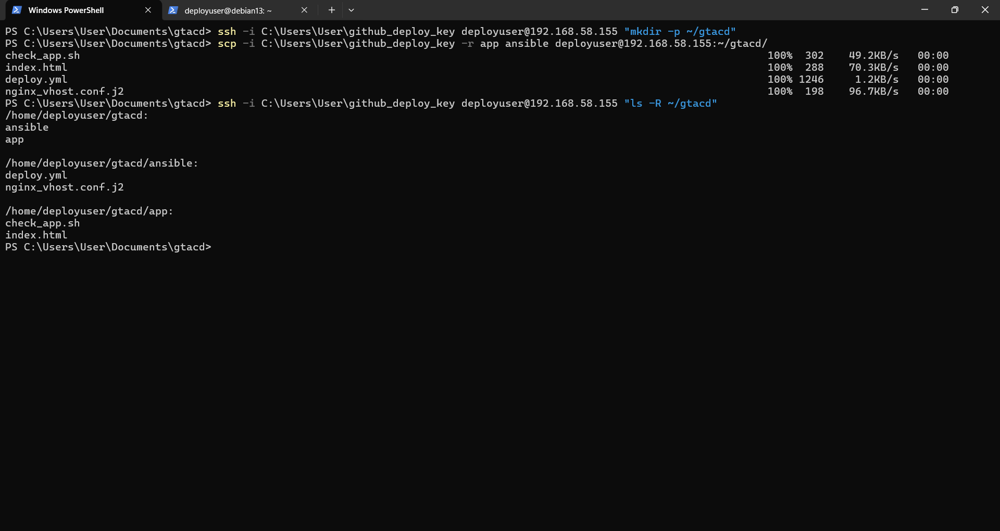

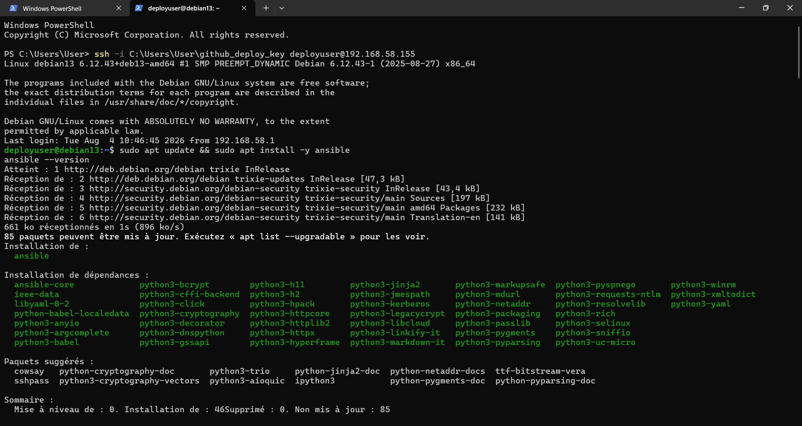

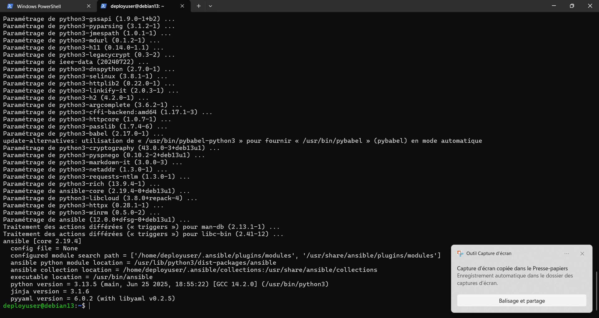

**Test à blanc (`--check`)** exécuté avant tout déploiement réel :

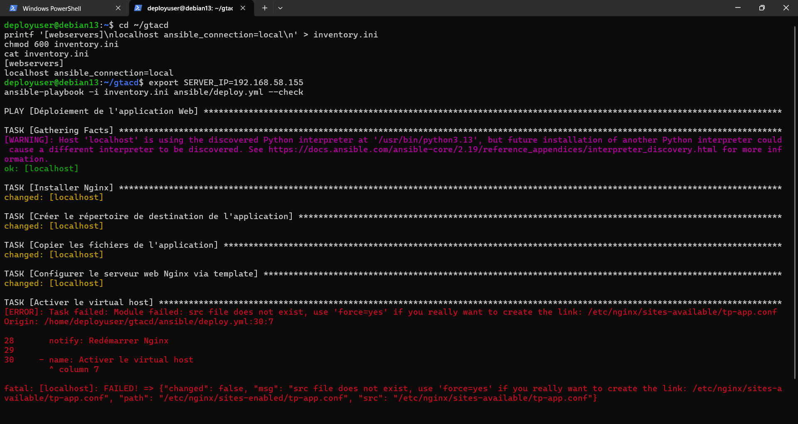

La tâche d'activation du vhost échoue en mode `--check` : le template n'étant
pas réellement écrit sur le disque, le fichier source du lien symbolique
n'existe pas. C'est une limite connue du dry-run d'Ansible, qui ne peut pas
simuler des tâches dont le résultat dépend d'une tâche précédente non
exécutée. Le contournement standard consiste à ajouter `check_mode: no` sur
les tâches concernées.

**Déploiement réel** — `ok=8 changed=7 failed=0`, handler exécuté :

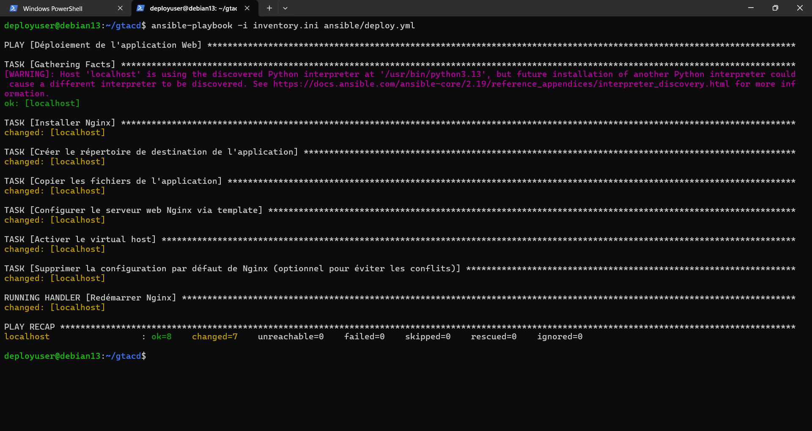

**Vérification** — configuration Nginx valide et template correctement rendu
avec l'adresse substituée :

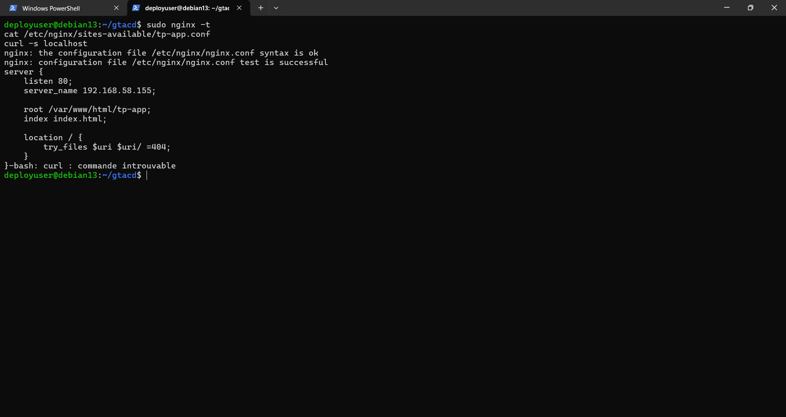

### Idempotence

Seconde exécution du playbook sans aucune modification préalable :
`changed=0`, aucun handler déclenché, Nginx non redémarré.

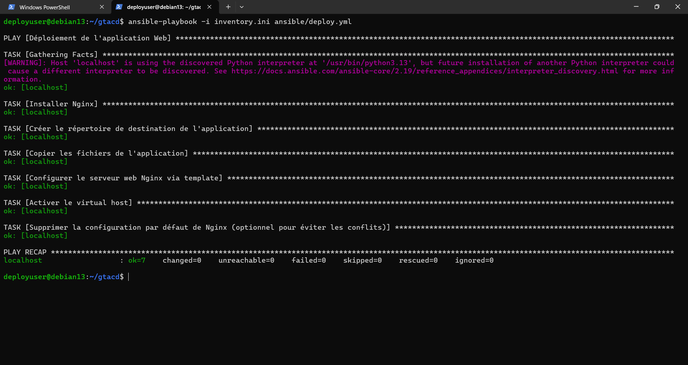

C'est la propriété centrale d'Ansible et un argument de sécurité à part
entière : rejouer un playbook ne produit aucun effet de bord si l'état cible
est déjà atteint. Un déploiement peut donc être relancé sans risque, ce qui
rend la remédiation et le rollback beaucoup plus sûrs.

---

## Job 6 — Intégration Ansible dans le workflow CD

Le workflow `ci_cd_full.yml` contient deux jobs :

- `build-and-test` — la phase CI
- `deploy` — conditionné par `needs: build-and-test`, donc jamais exécuté si
  les vérifications échouent. C'est le point le plus important du pipeline sur
  le plan sécurité : le déploiement est structurellement subordonné à la
  réussite des contrôles.

Étapes du job `deploy` :

1. `actions/checkout@v4`
2. `webfactory/ssh-agent@v0.9.0` — charge `SSH_PRIVATE_KEY` dans l'agent SSH du
   runner. Cette approche évite d'écrire la clé privée sur le disque.
3. génération dynamique de `inventory.ini` depuis les secrets, avec
   `chmod 600` immédiat
4. installation d'Ansible via pip
5. exécution du playbook, secrets passés en variables d'environnement

L'inventaire est généré à l'exécution plutôt que versionné : l'adresse du
serveur cible constitue une information d'infrastructure qui n'a pas à figurer
dans un dépôt public.

Le job `deploy` est conditionné par une variable de dépôt `REMOTE_DEPLOY`
(voir [Contrainte réseau](#contrainte-réseau-et-limites-de-lenvironnement)) et
apparaît donc en *Skipped* :

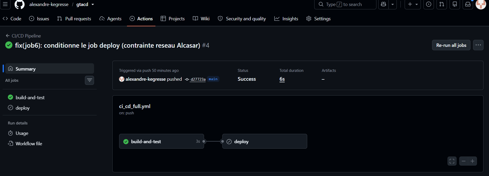

L'évolution de l'état des runs illustre l'effet de ce conditionnement — passage
d'un pipeline systématiquement en échec à un pipeline vert reflétant
correctement l'état réel :

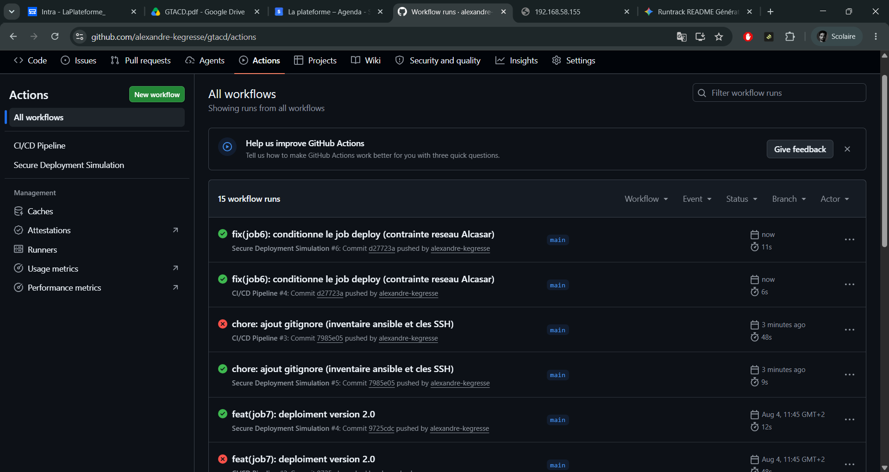

---

## Job 7 — Test du cycle complet

Modification de `app/index.html` pour marquer la version 2.0, commit, push sur
`main`, déclenchement automatique du pipeline, puis application du playbook sur
la VM.

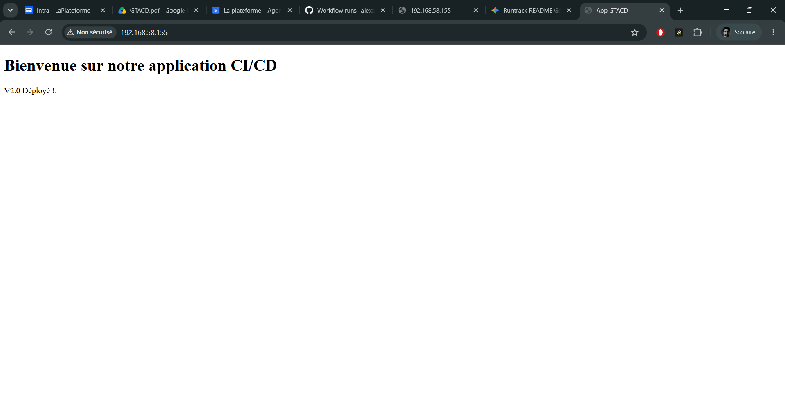

### Comparaison avec un déploiement manuel

| Critère | Manuel | Automatisé |
|---|---|---|
| Durée | Plusieurs dizaines de minutes | Quelques minutes |
| Reproductibilité | Variable selon l'opérateur | Identique à chaque exécution |
| Traçabilité | Partielle, déclarative | Commit + logs horodatés |
| Risque d'erreur | Élevé | Faible, concentré dans le code du pipeline |
| Rollback | Improvisé | `git revert` + nouveau cycle |

Les gains de sécurité sont directs : suppression des étapes manuelles où se
concentrent les erreurs de configuration, et surtout production d'une piste
d'audit exploitable. En cas d'incident, on sait précisément quelle version a
été déployée, quand, par qui, et on peut revenir à l'état antérieur.

Le corollaire est que **le pipeline devient lui-même une cible de premier
plan** : il détient les credentials de production et peut pousser du code
arbitraire. Il doit donc être protégé au même niveau que la production.

---

## Job 8 — Bilan et perspectives en cyberdéfense

### Récapitulatif

| Étape | Outil | Apport sécurité |
|---|---|---|
| Vérification du code | Script Bash + Actions | Détection avant déploiement |
| Gestion des secrets | GitHub Secrets | Chiffrement, masquage, non-exposition |
| Accès serveur | Clé SSH dédiée, `deployuser` | Moindre privilège, révocabilité |
| Déploiement | Ansible | Idempotence, configuration as code |
| Orchestration | GitHub Actions | Traçabilité, dépendance CI → CD |

### Pour aller plus loin

**SAST — analyse statique.** Intégration d'outils comme Semgrep ou CodeQL en
phase de CI pour détecter les vulnérabilités dans le code source avant même
qu'il ne soit fusionné. Un job dédié échouant sur une découverte critique
bloque le pipeline.

**SCA — analyse des dépendances.** La majorité du code d'une application
moderne provient de bibliothèques tierces. Trivy, Dependabot ou `pip-audit`
identifient les dépendances portant des CVE connues. C'est la contre-mesure
directe aux attaques de chaîne d'approvisionnement.

**DAST — tests dynamiques.** Après déploiement, un scanner comme OWASP ZAP
teste l'application en fonctionnement et détecte ce que l'analyse statique ne
peut pas voir : erreurs de configuration serveur, en-têtes de sécurité
manquants, comportements applicatifs à l'exécution.

**Génération d'un SBOM.** Un inventaire signé de tous les composants
logiciels déployés permet, à la publication d'une nouvelle CVE, de déterminer
immédiatement si l'infrastructure est concernée.

**Audit et détection d'anomalies.** Les logs GitHub Actions et Ansible
constituent une source de données exploitable en SIEM. Signaux d'alerte
pertinents : déploiement en dehors des heures ouvrées, exécution depuis une
branche inhabituelle, modification d'un fichier de workflow, ajout ou
modification d'un secret, échec répété d'authentification SSH sur le compte de
déploiement.

**Protection des environnements de production.** Approbation manuelle
obligatoire, réviseurs désignés, isolation réseau entre préproduction et
production, credentials distincts par environnement, fenêtres de déploiement
définies.

**Stratégie de rollback.** Une procédure de retour arrière testée
régulièrement est un contrôle de sécurité à part entière : elle réduit le
temps d'exposition à une version vulnérable. Trois approches complémentaires :
`git revert` suivi d'un nouveau cycle, conservation des artefacts des
versions précédentes pour redéploiement immédiat, ou déploiement blue-green
permettant une bascule instantanée. L'idempotence du playbook, démontrée au
Job 5, est le prérequis technique de toute stratégie de rollback fiable.

---

## Contrainte réseau et limites de l'environnement

### Ce qui fonctionne

- La chaîne d'intégration continue s'exécute intégralement sur GitHub Actions.
- Le playbook Ansible a été **exécuté réellement** sur la VM Debian cible :
  Nginx installé, application copiée, template Jinja2 rendu avec l'adresse
  substituée, service redémarré via handler, application accessible par
  navigateur, idempotence vérifiée sur une seconde exécution.
- Le job `deploy` du workflow est écrit, complet et fonctionnel.

### Ce qui est empêché

Un seul maillon ne peut pas être exercé : **la liaison réseau entre le runner
GitHub et la VM**.

La VM cible est située sur le réseau local de l'établissement, derrière un
portail captif Alcasar. Un runner GitHub hébergé est une machine éphémère sur
Internet : elle n'a aucune route vers une adresse privée, et le portail filtre
par ailleurs tout trafic entrant non authentifié. Le job de déploiement se
termine donc en timeout SSH.

### Choix retenu

Cette situation n'est pas un artefact de TP. Elle correspond exactement au cas
des entreprises dont l'infrastructure n'est pas exposée sur Internet, et pour
lequel les réponses industrielles sont connues : runner auto-hébergé placé
dans la zone réseau cible, bastion, ou tunnel sortant établi depuis
l'intérieur du périmètre.

Plutôt qu'un contournement fragile (exposition de la VM, tunnel tiers,
ouverture de port), deux dispositifs ont été mis en place :

1. Le workflow `secure-deployment-simulation.yml` valide en CI l'intégralité
   de la configuration de sécurité — format et robustesse de la clé,
   complétude des secrets, cohérence des variables — et matérialise les
   commandes qui seraient exécutées.
2. Le playbook Ansible a été validé par exécution réelle contre la VM, comme
   documenté au Job 5.

Le job `deploy` du pipeline complet est conservé et conditionné par une
variable de dépôt `REMOTE_DEPLOY`. Il apparaît en *Skipped* et non en *Failed*,
ce qui reflète correctement l'état réel : le code est prêt et sa logique est
prouvée, c'est l'environnement d'exécution qui ne permet pas la liaison
réseau.

Passer en production réelle ne demanderait qu'un runner auto-hébergé sur le
réseau de la VM et le passage de `REMOTE_DEPLOY` à `true`, sans aucune
modification du playbook ni du workflow.

---

## Compétences mobilisées

- Supervision et optimisation d'infrastructures
- Conception et évolution d'une infrastructure
- Déploiement et mise en production
